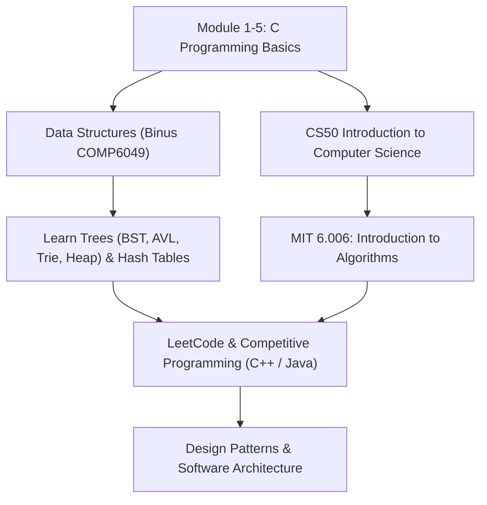

# 🎓 Module 6: Advanced Concepts & "What's Next?" (CS50 / MIT Preparation)

Congratulations! By completing Modules 1 through 5, you have mastered the foundational core of **Binus Algorithms & Programming** (COMP6047 / COMP6048). 

However, universities like **Harvard (CS50)** and **MIT (6.006)** push these concepts further into the realm of computer science theory, optimization, and abstract data structures. This module introduces those concepts and explains **why** they matter, **what** they are used for, and **where** you should go next.

---

## 🌀 1. Recursion vs. Iteration

### Why we learn this:
Some problems are naturally nested or branching. Writing them using standard loops (`for`/`while`) requires complex index tracking. Recursion solves this by allowing a function to call itself with a smaller sub-problem, dividing the workload.

### What we use it for:
Recursive algorithms are used to traverse trees (like directory folders on your computer), solve math problems (like factorials or Fibonacci), and divide-and-conquer datasets (like Merge Sort or Quick Sort).

### The Call Stack:
Every time a function calls itself, a new **Stack Frame** is pushed onto the CPU's memory stack. If recursion is too deep and has no exit condition (base case), the program will crash with a **Stack Overflow**.

---

## 📈 2. Algorithmic Complexity (Big O Notation)

### Why we learn this:
It is not enough for code to just "work." It must run efficiently. Big O notation measures how the running time or memory usage of an algorithm scales as the input size ($n$) grows.

```text
Complexity Growth Rate (from fastest to slowest execution):
O(1) < O(log n) < O(n) < O(n log n) < O(n^2) < O(2^n)
```

*   **$O(1)$ [Constant Time]**: Execution time stays the same regardless of input size (e.g. array index lookup).
*   **$O(\log n)$ [Logarithmic Time]**: Dataset is halved at each step (e.g. Binary Search).
*   **$O(n)$ [Linear Time]**: Execution time grows proportionally to input size (e.g. Linear Search).
*   **$O(n \log n)$ [Linearithmic Time]**: Divide-and-conquer sorting (e.g. Merge Sort).
*   **$O(n^2)$ [Quadratic Time]**: Nested loops over the same array (e.g. Bubble Sort).

---

## 🌳 3. Beyond Simple Structs: Trees & Graphs

### Why we learn this:
A Single Linked List is linear; each node points to only one next node. But real-world data is hierarchical or networked. 

*   **Binary Search Tree (BST)**: A tree structure where each node has at most two children. The left child is smaller, and the right child is larger than the parent.
*   **AVL & Red-Black Trees**: Self-balancing BSTs that guarantee $O(\log n)$ search, insert, and delete times. (Highly covered in Binus Data Structures COMP6048!).

```text
Binary Search Tree:
       [ 45 ]
      /      \
   [ 20 ]   [ 77 ]
   /    \
[ 12 ] [ 32 ]
```

---

## 🚀 4. Where to Start Next? (Your Roadmap)

If you have completed this course companion and want to prepare for the "real deal" in software engineering, follow this roadmap:



1.  **Transition to C++ or Java**: C forces you to manage memory manually, which is great for understanding concepts. However, modern software engineering uses OOP (Object-Oriented Programming). C++ or Java are natural next steps.
2.  **Take CS50 (Harvard)**: It is free online. It expands on your C foundations, then moves to Python, SQL, and HTML/CSS web logic.
3.  **Take MIT 6.006 (Introduction to Algorithms)**: Available on MIT OpenCourseWare. Focuses heavily on mathematical analysis, graph traversal, and dynamic programming.
4.  **Practice on LeetCode**: Solve array, pointer, and linked list problems in C/C++ to build coding muscle memory for job interviews.

---

## 🏃 Runnable Code Examples
Check out:
1.  [**`recursion_and_complexity.c`**](recursion_and_complexity.c) — Run factorials and Fibonacci sequences with recursion depth print statements to visualize the Call Stack.
