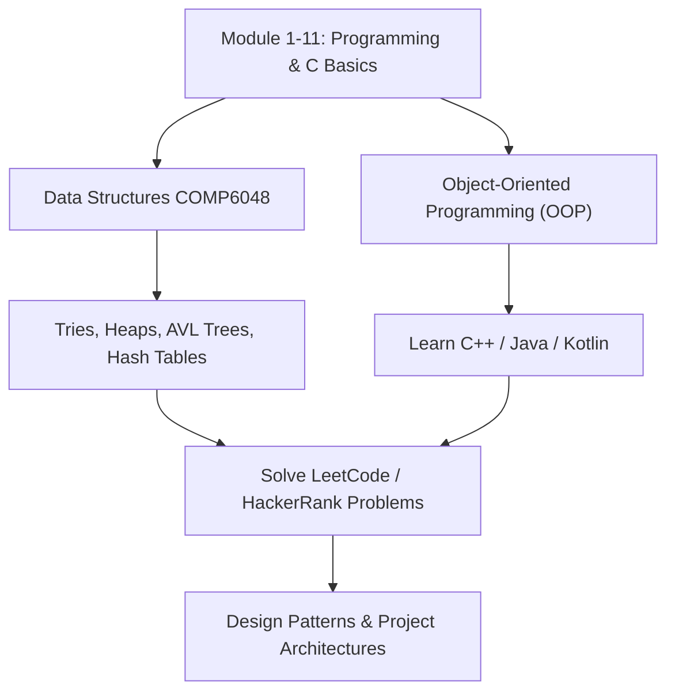

# 🎓 Session 12: Advanced Concepts (CS50 / MIT)

This final session bridges the gap between the foundational **Binus Algorithms & Programming** course and advanced Computer Science theory taught in **Harvard CS50** and **MIT 6.006**. It explains **why** we study these concepts, **what** they are used for, and **where** to go next.

---

## 📈 1. Algorithmic Complexity (Big O Notation)

### Why we learn this:
It is not enough for code to just compile. It must run efficiently. Big O notation measures how the execution time or memory footprint of an algorithm scales as the input size ($n$) grows.

```text
Complexity Growth Rate (Fastest ➡️ Slowest):
O(1) < O(log n) < O(n) < O(n log n) < O(n^2) < O(2^n)
```

*   **$O(1)$ [Constant Time]**: Execution time is fixed (e.g., getting an item from an array by index).
*   **$O(\log n)$ [Logarithmic Time]**: Dataset is halved at each step (e.g., Binary Search).
*   **$O(n)$ [Linear Time]**: Execution time scales proportionally to input size (e.g., Linear Search).
*   **$O(n \log n)$ [Linearithmic Time]**: Divide-and-conquer sorting (e.g., Merge Sort).
*   **$O(n^2)$ [Quadratic Time]**: Nested loop operations over a dataset (e.g., Bubble Sort).

---

## 🌳 2. Abstract Data Structures: Trees & Graphs

### Why we learn this:
Linked Lists are linear (one-dimensional). However, many real-world datasets are hierarchical (like family trees or folder filesystems) or network-based (like social media friendships or GPS map routes).

#### Binary Search Tree (BST)
A tree structure where each node has at most two children. The left child's data is smaller, and the right child's data is larger than the parent.
*   **Complexity**: Searches, insertions, and deletions take $O(\log n)$ average time.

```text
Binary Search Tree structure:
       [ 50 ]
      /      \
   [ 30 ]   [ 70 ]
   /    \
[ 15 ] [ 40 ]
```

#### Self-Balancing Trees (AVL / Red-Black Trees)
If elements are inserted into a BST in sorted order (e.g. `10, 20, 30, 40`), the tree collapses into a straight line, degrading search performance to $O(n)$ (like a linked list). Self-balancing trees perform **rotations** during insertion and deletion to keep the tree balanced, guaranteeing $O(\log n)$ operations. (Crucial topic in Binus Data Structures COMP6048!).

#### Graphs
A collection of nodes (vertices) connected by lines (edges).
*   **What they are used for**: Map routing (GPS), social networking links, and web page crawling.

---

## 🚀 3. What's Next? (Your Roadmap)

Now that you have mastered the basics of Algorithms & Programming, follow this roadmap to level up:



1.  **Transition to Object-Oriented Programming (OOP)**: C is a procedural language. For enterprise development, learn OOP in **C++**, **Java**, or **Kotlin**.
2.  **Take CS50 (Harvard)**: Introduces Python, SQL, HTML/CSS/JS, and software engineering mindsets.
3.  **Take MIT 6.006 (Algorithms)**: Deep dive into mathematical analysis, hash tables, graph traversals (Breadth-First Search, Depth-First Search), and Dynamic Programming.
4.  **Practice Solving Problems**: Build muscle memory by solving array, pointer, and linked list exercises on **LeetCode** or **HackerRank**.
